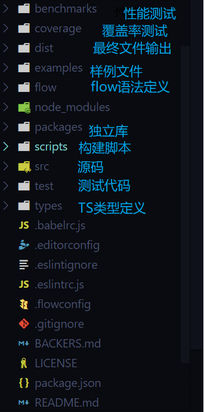
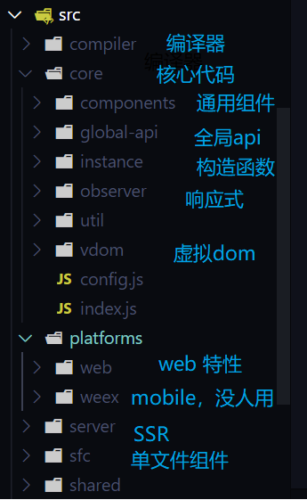

# Vue workshop笔记

> 本项目仅用作本人记录学习笔记，代码备份，严禁下载和转载

## 01 组件化原理笔记

### 组件间通讯

> 组件通讯方式有：prop，event，vuex，eventbus，\$on,  $emit, provide/inject，vm实例：ref, \$parent,

#### **常规组件化通讯方式**

* props：父组件通过子组件声明的prop传递消息给子组件
* event：父组件监听子组件的事件，子组件通过emit传递消息给父组件
* vuex：所有组件共享状态，可以通过vuex api访问，设置状态

#### 非主流通讯方式

* event bus/\$on/\$emit

  组件使用event bus可以实现跨层级的访问

  ```javascript
  /* event bus*/
  // event bus需要实现$emit触发事件，$on监听事件和callbacks缓存
  // 可以通过直接实例化Vue得到event bus
  // 使用原则：谁监听，谁触发
  // 组件1
  import EvtBus from '@/utils/EventBus'
  EvtBus.$on('CustEvt', function cb(evt) {
    // 回调方法...
  })
  
  // 组件2
  import EvtBus from '@/utils/EventBus'
  EvtBus.$emit('CustEvt', 'hello')
  
  /* 通过公用$root节点*/
  // 组件1
  this.$root.$on('CustEvt', function cb(evt) {
    // 回调方法...
  })
  // 组件2
  this.$root.$emit('CustEvt', 'hello')
  ```

  

* provide/inject

  用于和子孙组件通信

  *要注意Vue不会对provide的数据进行响应式处理，provide响应式的数据可以实现响应式的效果，见Day1代码*

  ```javascript
  // 祖先组件
  {
      provide() {
          // 用函数形式配置的provide能获得this指向的vm实例，对象形式的不可以
          form: this,
          test: 123
      }
  }
  // 子组件
  {
      inject: ['form', 'test'],
      inject: {
          form1: 'form', // 子组件将其重命名为form1
      }，
      inject: {
          form1: {
              from: 'form', // 子组件将其重命名为form1
              default: {}   // 注入失败时的fallback值
          }
      }
  }
  ```

  

* vm实例

  通过遍历实例树直接访问到对应vm实例进行通讯

  *需要注意的是 api 获取到的都是 vm 元素，而不是 DOM 元素*

  ```javascript
  this.$parent
  this.$root
  this.$children
  this.$refs
  ```


* dispatch/broadcast

  递归的向指定的祖先/子孙组件分发事件，可以使用 `compName `  指定接收事件的组件的类型，element-ui做法是每个组件定义 `componentName` 作为组件的名字（name无法获取)

  ```javascript
  function dispatch (compName, eventName, value) {
    let comp = this
    while (comp && comp.$options.componentName !== compName) {
      comp = comp.$parent
    }
    comp.$emit(eventName, value)
  }
  
  export default {
    install(Vue) {
      Vue.prototype.$dispatch = dispatch
      // Vue.prototype.broadcast = broadcast
    }
  }
  
  ```

  


### 高阶组件

为了方便使用/扩展特性，通常可以将组件封装成高阶组件

父组件传递的子组件props中未定义的属性，子组件可以通过 `$attrs` 访问（不包括 `class` 和 `style` ）

父组件的事件监听可以通过 `$listeners` 访问

使用  `v-bind="$attrs"`  `v-on="$listeners"`  的方式将高阶组件接收的属性和事件传递给要封装的组件

这种方式叫做 `透传`，react中的写法为： `<el-input {...\$attrs}  {...\$listeners}>`


```vue
<template>
    <div>
        <!-- 将属性，事件透传给子组件 -->
        <el-input v-bind="$attrs" v-on="$listeners"></el-input>
    </div>
</template>
<script>
    export default {
        // 让根元素不继承attrs
        inheritAttrs: false
    }
</script>
```


### 内容分发-插槽

父组件作为布局容器，将子组件放置到指定位置，插槽组要有`匿名插槽`，`具名插槽`和`作用域插槽`

```html
<!--匿名-->
<!--parent-->
<div>
    <slot></slot>
</div>

<parent>hello</parent>

<!--具名-->
<!--parent-->
<div>
    <slot bame="title"></slot>
</div>

<parent>
    <div v-slot:title>
        title
    </div>
    hello
</parent>

<!--作用域-->
<!--parent-->
<div v-for="item in items">
    <slot name="title" :item="item"></slot>
    <slot></slot>
</div>

<parent :items="items">
    <div  v-slot:title="scope" >
        {{ scope.item.title }}
    </div>
    hello
</parent>


```


## 02 全家桶原理和实现

### vue-router

> vue-router的意义是：使用VUE能够构建SPA应用

**使用**

* 安装 `vue add router`

* 配置插件

  ```js
  // router.js
  import VueRouter from 'vue-router'
  import routes from './routes'
  Vue.use(VueRouter)
  
  export default new VueRouter({..., routes }) // 路由表
  ```

* 在Vue根实例引入

  ```javascript
  import router from './router'
  new Vue({  router, }).$mount("#app")
  ```

* 组织页面结构，配置视图和导航

  ```html
  <router-view></router-view>
  <router-link to="/">Home</router-link>
  <router-link to="/about">About</router-link>
  ```


**源码实现**

需求：

* 插件化，Router类
* 提供`$router`，`\$router.push`
* 提供两个全局组件`<router-view>`和`<router-link>`
* 监听URL变化：window.addEventListener('hashchange')
* 响应式的更换router-view中的组件

嵌套路由的解决方式：


### vuex

> Vuex 集中式存储管理应⽤的所有组件的状态，并以相应的规则保证状态以可预测的⽅式发⽣变化


**源码实现**

* 插件化，Vuex类
* 提供`$store`
* 实现响应式的`state`和`getter`
* 实现`commit`和`dispatch`


## 03 手写Vue源码

### MVVM框架的三要素

数据响应式、模板引擎及其渲染

- 数据响应式，是典型的观察者模式，主要的任务是提供收集依赖的方法(set)，监听数据变化，并通知依赖函数

- 模板引擎，提供描述视图的模板语法

  解析模板中的动态元素，以及对应的update方法(-->vdom)，并将方法作为**观察者**，添加到对应数据的依赖队列中

- 渲染：如何将模板转换为html （vdom=>dom) $mount

### 手写Vue

无vdom+渲染

* KVue：框架构造函数
* Observer：执⾏数据响应化（分辨数据是对象还是数组）
* Compile：编译模板，初始化视图，收集依赖（更新函数、watcher创建）
* Watcher：执⾏更新函数（更新dom） Dep：管理多个Watcher，批量更新
* Dep：管理多个Watcher，批量更新


## 04 Vue源码解析

### 如何学习源码

* 按照api仿写核心功能
* 读源码
* 整理整体结构，流程关键技术的思维导图
* 调试--验证是否读懂了

### Vue2.6代码学习

项⽬地址：https://github.com/vuejs/vue

`package.json`中`dev`加`--sourcemap`参数


**代码调试**

`npm run dev` 会在dist中生成带有`sourcemap`的`vue`代码

编写测试`html`文件引用`./dist/vue.js`

* 本地文件调试，直接打开测试用

* web服务器serve文件调试，安装`http-server`，在根目录下运行，输入测试文件的url即可

* 使用vscode作为debugger

  * 安装`debugger for chrome`插件，并配置`launch.json`

  * 文件调试

    ```js
    { // 文件方式直接打开一个文件，不需要启动服务
        "name": "Launch index.html",
        "type": "chrome",
        "request": "launch",
        "file": "${workspaceFolder}/index.html"
    },
    ```

  * web服务器serve文件调试

    ```js
    { // url方式，需要启动http-server
        "name": "Launch localhost",
        "type": "chrome",
        "request": "launch",
        "url": "http://localhost:8080", // url要能访问到服务器
        "webRoot": "${workspaceFolder}/"，
        // 需要时添加
        // "webRoot": "${workspaceFolder}/wwwroot"
    },
    ```

  * attach调试

    命令行/chrome快捷方式加启动参数`--remote-debugging-port=9222`

    ```js
    {
        "name": "Attach to url with files served from ./out",
        "type": "chrome",
        "request": "attach",
        "port": 9222,
        "url": "<url of the open browser tab to connect to>",
        "webRoot": "${workspaceFolder}/out"
    }
    ```

    

**整体结构**




### **初始化流程**

new Vue() => _init() => $mount() => mountComponent() => updateComponent()/new Watcher() =>  render() => _update()


老杨的画的：https://www.processon.com/view/link/5da6c108e4b002a6448895c3


### **响应式（TODO）**

文字描述/流程图


## 05 Vue源码解析 02

### vue的异步更新

* 异步：只要侦听到数据变化，Vue 将开启⼀个队列，并缓冲在同⼀事件循环中发⽣的所有数据变更。
* 批量：如果同⼀个 watcher 被多次触发，只会被推⼊到队列中⼀次。去重对于避免不必要的计算 和 DOM 操作是⾮常重要的。然后，在下⼀个的事件循环“tick”中，Vue 刷新队列执⾏实际⼯作。 
* 异步策略：Vue 在内部对异步队列尝试使⽤原⽣的 Promise.then、MutationObserver 或setImmediate，如果执⾏环境都不⽀持，则会采⽤ setTimeout 代替。


## 组件渲染

### 虚拟dom（vdom, vnode)

> 虚拟DOM（Virtual DOM）是对DOM的JS抽象表示，它们是JS对象，能够描述DOM结构和关系。应⽤ 的各种状态变化会作⽤于虚拟DOM，终映射到DOM上


**虚拟dom是在vue2.0中加入的**

vue 1.0中有细粒度的数据变化侦测，它是不需要虚拟DOM的，但是细粒度造成了⼤量开销，这对于⼤ 型项⽬来说是不可接受的。因此，vue 2.0选择了中等粒度的解决⽅案，每⼀个组件⼀个watcher实例， 这样状态变化时只能通知到组件，再通过引⼊虚拟DOM去进⾏⽐对和渲染


**虚拟dom的优点**

* 跨平台，vdom是对dom的抽象，提供不同的vdom渲染函数就可以在不同平台使用
* 高效
  * 最小化更新，通过dom diff算法比较出变化的部分进行patch更新
  * 批量异步更新
* 轻量
* 双缓存，依次性将所有变化绘制出来


### 渲染过程

watcher.run() => componentUpdate() => render() => update() => patch()


## 加餐

### 01 实现递归组件

实现递归组件有三个核心原则：第一自己调用自己，第二要有终止条件，第三name是必要的，例子：

```vue
<template>
    <div>
        <h3>{{data.name}}</h3> <!-- 有条件嵌套 -->
        <Node v-for="n in data.children" :key="n.name" :data="n"> </Node>
    </div>
</template>
<script>
    export default {
        name: 'Node', // name对递归组件是必要的        
        props: {
            data: {
                type: Object,
                require: true
            },
        },
    }
</script>
```


### 02 如何编写Vue插件

> vue插件需要是一个函数或者是包含install函数的对象，一般使用第二种用class定义

* 在install函数中使用局部变量`_Vue`引用全局实例`Vue`以便后期使用

  ps: 不用`import Vue`获得`Vue`是为了防止它被打包到组件中

* 定义全局方法：插件创建时Vue实例还不存在，可以使用全局的**mixins**让定义后移在beforeCreate中注入

  ```javascript
  // 将定义时机后移
  function install() {
    Vue.mixins({
      beforeCreate() {
        _Vue.prototype.xxx= xxx
      }
    })
  }
  ```


### 03 如何让对象变成响应式

* Vue.util.defineReactive
* Vue.obserable
* new Vue() + vm._data/vue.$data


### 04 Vue MVVM框架的思考

MVVM：数据变化自动更新视图

**哪些UI需要可以更新？**编译动态部分--词法解析 指令 {{}} @等

**怎么更新？**每个词法对应一个updater，传入dom，vm，key（expression）==>vdom

**数据变了更新谁？** compile时将update封装成watcher放入prop.Dep=[]（全局变量搭桥，vm.prop[get]收集）

**什么时候更新？**响应式属性值变化时

* 响应式(reactive)的数据

  * 2.6 通过属性劫持(getter, setter)
  * 3.0 通过proxy，无需预处理，无需递归，性能提升的原因之一

* UI渲染

  * 通过compiler将template编译成render函数
  * render函数执行生成vdom
  * 通过dom diff算法计算出变化的节点
  * 渲染dom树, 初次渲染通过$mount() vdom --> dom

* 数据变化触发UI渲染（get收集依赖，set触发依赖）

  * 调用render函数会访问其中响应式数据的属性，这时会收集对该属性的依赖，将该render加入属性的依赖数组中
  * 为响应式属性设置值时，会触发依赖的函数

  

### 05 Vue中对象的形态

* Vue class

  用来处理全局的功能：使用插件，声明全局的组件，全局混入，prototype属性

* Vue config

  vue的配置对象，通过new Vue，Vue.extend等方式创建Vue实例：vm

* Vue实例vm

  vue组件的object api形式，可以操作_data, computed，router...，调用$mount可以获得dom （\$el属性）


## 翻车日记

### Day1

1. 配置 vue-router，没有调用Vue.use, new VueRouter routes配置结构写错了

2. Vue-cli生成的项目不支持, Vue({template: 'xxx'}), 因为只有runtime不包括compile代码可以通过设置一下选项添加该特性，但是vue的体积会变大

   ```javascript
   // vue.config.js
   module.exports = {
     runtimeCompiler: true
   }
   
   ```

3.  router.beforeEach 中打断点看路由跳转，结果忘了调用next()，路由一直不跳转

4. async-validator，使用async/await的方式使用，返回验证失败的方式是Promise.reject，没有使用try catch处理，加上控制台的报错很奇葩看不出来是Promise.reject卡了N久

5. 写代码时eslint总出提示，而且vscode不自动修复效率很低，打断思路

### Day2

1. router-view, render函数h()一个vm实例，其实需要的是配置，TODO: vue中的对象得几种形态
 	2. 用法不对卡了一会儿_Vue.util.defineReactive(object, key, func)，没传key总多了一个undefined
   	3. 写getters忘了return

### Day3

1. node的子节点使用了children，应该使用childNodes，否则获取不到text节点
2. v-model时候卡住了，应为定义了一个‘model’属性和model的处理函数冲突了，应该做一些命名方面/作用域的限制
3. 模块化和函数编程不足，实现了功能但是没有很好的抽象成模块，功能函数

## Next

### 源码学习

* vue
* vuex
* vue-router
* element-ui

### 三大框架MVVM设计横纵对比x响应式+模板引擎+渲染，三维表格？

vue1,2,3 getter, proxy

ng

react, setState


### 逐渐完善手写的框架


### 不编译直接使用render的组件如何收集依赖？调一下？


### 使用snabbdom完善手写的mvvm代码

渲染部分，通知到组件 vue1 - vue2

https://github.com/snabbdom/snabbdom


MVVM参考

https://www.cnblogs.com/Michelle20180227/p/9790149.html


dom diff

https://www.jianshu.com/p/bf9a8b4773ee


### 最佳实践


### 资源/工具/库