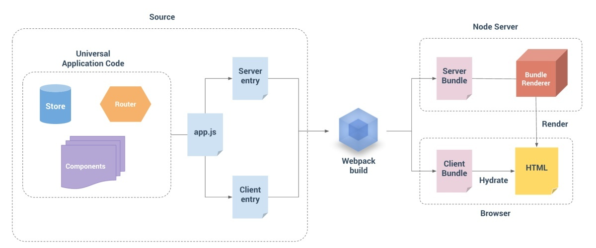

# Vue workshop笔记

> 本项目仅用作本人记录学习笔记，代码备份，严禁下载和转载

## 01 组件化原理笔记

### 组件间通讯

> 组件通讯方式有：prop，event，vuex，eventbus，\$on,  $emit, provide/inject，vm实例：ref, \$parent,

#### **常规组件化通讯方式**

* props：父组件通过子组件声明的prop传递消息给子组件
* event：父组件监听子组件的事件，子组件通过emit传递消息给父组件
* vuex：所有组件共享状态，可以通过vuex api访问，设置状态

#### 非主流通讯方式

* event bus/\$on/\$emit

  组件使用event bus可以实现跨层级的访问

  ```javascript
  /* event bus*/
  // event bus需要实现$emit触发事件，$on监听事件和callbacks缓存
  // 可以通过直接实例化Vue得到event bus
  // 使用原则：谁监听，谁触发
  // 组件1
  import EvtBus from '@/utils/EventBus'
  EvtBus.$on('CustEvt', function cb(evt) {
    // 回调方法...
  })
  
  // 组件2
  import EvtBus from '@/utils/EventBus'
  EvtBus.$emit('CustEvt', 'hello')
  
  /* 通过公用$root节点*/
  // 组件1
  this.$root.$on('CustEvt', function cb(evt) {
    // 回调方法...
  })
  // 组件2
  this.$root.$emit('CustEvt', 'hello')
  ```

  

* provide/inject

  用于和子孙组件通信

  *要注意Vue不会对provide的数据进行响应式处理，provide响应式的数据可以实现响应式的效果，见Day1代码*

  ```javascript
  // 祖先组件
  {
      provide() {
          // 用函数形式配置的provide能获得this指向的vm实例，对象形式的不可以
          form: this,
          test: 123
      }
  }
  // 子组件
  {
      inject: ['form', 'test'],
      inject: {
          form1: 'form', // 子组件将其重命名为form1
      }，
      inject: {
          form1: {
              from: 'form', // 子组件将其重命名为form1
              default: {}   // 注入失败时的fallback值
          }
      }
  }
  ```

  

* vm实例

  通过遍历实例树直接访问到对应vm实例进行通讯

  *需要注意的是 api 获取到的都是 vm 元素，而不是 DOM 元素*

  ```javascript
  this.$parent
  this.$root
  this.$children
  this.$refs
  ```


* dispatch/broadcast

  递归的向指定的祖先/子孙组件分发事件，可以使用 `compName `  指定接收事件的组件的类型，element-ui做法是每个组件定义 `componentName` 作为组件的名字（name无法获取)

  ```javascript
  function dispatch (compName, eventName, value) {
    let comp = this
    while (comp && comp.$options.componentName !== compName) {
      comp = comp.$parent
    }
    comp.$emit(eventName, value)
  }
  
  export default {
    install(Vue) {
      Vue.prototype.$dispatch = dispatch
      // Vue.prototype.broadcast = broadcast
    }
  }
  
  ```

  


### 高阶组件

为了方便使用/扩展特性，通常可以将组件封装成高阶组件

父组件传递的子组件props中未定义的属性，子组件可以通过 `$attrs` 访问（不包括 `class` 和 `style` ）

父组件的事件监听可以通过 `$listeners` 访问

使用  `v-bind="$attrs"`  `v-on="$listeners"`  的方式将高阶组件接收的属性和事件传递给要封装的组件

这种方式叫做 `透传`，react中的写法为： `<el-input {...\$attrs}  {...\$listeners}>`


```vue
<template>
    <div>
        <!-- 将属性，事件透传给子组件 -->
        <el-input v-bind="$attrs" v-on="$listeners"></el-input>
    </div>
</template>
<script>
    export default {
        // 让根元素不继承attrs
        inheritAttrs: false
    }
</script>
```


### 内容分发-插槽

父组件作为布局容器，将子组件放置到指定位置，插槽组要有`匿名插槽`，`具名插槽`和`作用域插槽`

```html
<!--匿名-->
<!--parent-->
<div>
    <slot></slot>
</div>

<parent>hello</parent>

<!--具名-->
<!--parent-->
<div>
    <slot bame="title"></slot>
</div>

<parent>
    <div v-slot:title>
        title
    </div>
    hello
</parent>

<!--作用域-->
<!--parent-->
<div v-for="item in items">
    <slot name="title" :item="item"></slot>
    <slot></slot>
</div>

<parent :items="items">
    <div  v-slot:title="scope" >
        {{ scope.item.title }}
    </div>
    hello
</parent>


```


## 02 全家桶原理和实现

### vue-router

> vue-router的意义是：使用VUE能够构建SPA应用

**使用**

* 安装 `vue add router`

* 配置插件

  ```js
  // router.js
  import VueRouter from 'vue-router'
  import routes from './routes'
  Vue.use(VueRouter)
  
  export default new VueRouter({..., routes }) // 路由表
  ```

* 在Vue根实例引入

  ```javascript
  import router from './router'
  new Vue({  router, }).$mount("#app")
  ```

* 组织页面结构，配置视图和导航

  ```html
  <router-view></router-view>
  <router-link to="/">Home</router-link>
  <router-link to="/about">About</router-link>
  ```


**源码实现**

需求：

* 插件化，Router类
* 提供`$router`，`\$router.push`
* 提供两个全局组件`<router-view>`和`<router-link>`
* 监听URL变化：window.addEventListener('hashchange')
* 响应式的更换router-view中的组件

嵌套路由的解决方式：


### vuex

> Vuex 集中式存储管理应⽤的所有组件的状态，并以相应的规则保证状态以可预测的⽅式发⽣变化


**源码实现**

* 插件化，Vuex类
* 提供`$store`
* 实现响应式的`state`和`getter`
* 实现`commit`和`dispatch`


## 03 手写Vue源码

### MVVM框架的三要素

数据响应式、模板引擎及其渲染

- 数据响应式，是典型的观察者模式，主要的任务是提供收集依赖的方法(set)，监听数据变化，并通知依赖函数

- 模板引擎，提供描述视图的模板语法

  解析模板中的动态元素，以及对应的update方法(-->vdom)，并将方法作为**观察者**，添加到对应数据的依赖队列中

- 渲染：如何将模板转换为html （vdom=>dom) $mount

### 手写Vue

无vdom+渲染

* KVue：框架构造函数
* Observer：执⾏数据响应化（分辨数据是对象还是数组）
* Compile：编译模板，初始化视图，收集依赖（更新函数、watcher创建）
* Watcher：执⾏更新函数（更新dom） Dep：管理多个Watcher，批量更新
* Dep：管理多个Watcher，批量更新


## 04 Vue源码解析

### 如何学习源码

* 按照api仿写核心功能
* 读源码
* 整理整体结构，流程关键技术的思维导图
* 调试--验证是否读懂了

### Vue2.6代码学习

项⽬地址：https://github.com/vuejs/vue

`package.json`中`dev`加`--sourcemap`参数


**代码调试**

`npm run dev` 会在dist中生成带有`sourcemap`的`vue`代码

编写测试`html`文件引用`./dist/vue.js`

* 本地文件调试，直接打开测试用

* web服务器serve文件调试，安装`http-server`，在根目录下运行，输入测试文件的url即可

* 使用vscode作为debugger

  * 安装`debugger for chrome`插件，并配置`launch.json`

  * 文件调试

    ```js
    { // 文件方式直接打开一个文件，不需要启动服务
        "name": "Launch index.html",
        "type": "chrome",
        "request": "launch",
        "file": "${workspaceFolder}/index.html"
    },
    ```

  * web服务器serve文件调试

    ```js
    { // url方式，需要启动http-server
        "name": "Launch localhost",
        "type": "chrome",
        "request": "launch",
        "url": "http://localhost:8080", // url要能访问到服务器
        "webRoot": "${workspaceFolder}/"，
        // 需要时添加
        // "webRoot": "${workspaceFolder}/wwwroot"
    },
    ```

  * attach调试

    命令行/chrome快捷方式加启动参数`--remote-debugging-port=9222`

    ```js
    {
        "name": "Attach to url with files served from ./out",
        "type": "chrome",
        "request": "attach",
        "port": 9222,
        "url": "<url of the open browser tab to connect to>",
        "webRoot": "${workspaceFolder}/out"
    }
    ```

    

**整体结构**


### **初始化流程**

new Vue() => _init() => $mount() => mountComponent() => updateComponent()/new Watcher() =>  render() => _update()


老杨的画的：https://www.processon.com/view/link/5da6c108e4b002a6448895c3


### **响应式（TODO）**

文字描述/流程图


## 05 Vue源码解析 02

### vue的异步更新

* 异步：只要侦听到数据变化，Vue 将开启⼀个队列，并缓冲在同⼀事件循环中发⽣的所有数据变更。
* 批量：如果同⼀个 watcher 被多次触发，只会被推⼊到队列中⼀次。去重对于避免不必要的计算 和 DOM 操作是⾮常重要的。然后，在下⼀个的事件循环“tick”中，Vue 刷新队列执⾏实际⼯作。 
* 异步策略：Vue 在内部对异步队列尝试使⽤原⽣的 Promise.then、MutationObserver 或setImmediate，如果执⾏环境都不⽀持，则会采⽤ setTimeout 代替。


### 组件渲染

> Vue使用render函数将组件转换为vnode，之后使用updateComponent将vnode转换为dom渲染到页面上

#### 虚拟dom（vdom, vnode)

> 虚拟DOM（Virtual DOM）是对DOM的JS抽象表示，它们是JS对象，能够描述DOM结构和关系。应⽤ 的各种状态变化会作⽤于虚拟DOM，终映射到DOM上


**虚拟dom是在vue2.0中加入的**

vue 1.0中有细粒度的数据变化侦测，它是不需要虚拟DOM的，但是细粒度造成了⼤量开销，这对于⼤ 型项⽬来说是不可接受的。因此，vue 2.0选择了中等粒度的解决⽅案，每⼀个组件⼀个watcher实例， 这样状态变化时只能通知到组件，再通过引⼊虚拟DOM去进⾏⽐对和渲染


**虚拟dom的优点**

* 跨平台，vdom是对dom的抽象，提供不同的vdom渲染函数就可以在不同平台使用
* 高效
  * 最小化更新，通过dom diff算法比较出变化的部分进行patch更新
  * 批量异步更新
* 轻量
* 双缓存，依次性将所有变化绘制出来


#### 渲染过程

watcher.run() => componentUpdate() => render() => update() => patch()


## 06 Vue源码解析03

### 模板编译

> 模板编译的目的是生成组件得render函数


**为什么需要编译**

vue组件渲染需要通过执行`render()`函数将组件转换成`vnode`，使用render编写组件结构有很多缺点：过于复杂，不够直观效率太低。一种解决方案是：用户编写`<template>` 再由`compiler`变成`render`函数


**编译过程**

编译可以将一种语言转换为另一种语言，一般有：编译（parse），转换（transform）和生成（generate）三个部分。vue中的编译分为：编译，优化和生成，通过编译将template转换由createElement描述结构的render方法。优化对静态节点进行了标记，静态节点不需要做对比和更新操作


### 组件化原理

> 组件被当作定制化元素处理，当父组件渲染遇到comp-元素时会创建comp vnode和实例化
>
> comp内部的template和逻辑由组件自己处理

new Vue() => $mount() => vm._render() => createElement() => createComponent()
=> vm._update() => patch() => createElm => createComponent()


## 07 ssr概念以及应用

### SSR概念



**什么是SSR？**

SSR (server side render，服务器端渲染）是指在服务器端生成完整的HTML再由浏览器解析渲染成页面，如：jsp, php, asp...，其他渲染策略还有：

* CSR(server side render，客户端渲染) 主要在客户端通过JS生成dom渲染，如：

  react，vue，angular，dojo...

* 同构渲染（ SSR+CSR）: 服务器客户端使用同一套代码，服务器负责生成首屏html页面，首次渲染后客户端代码接管之后的交互


**SSR解决了什么问题？**

SSR解决了首屏性能问题和*SEO*（Search Engine Optimization，搜索引擎优化的问题）

* 首屏性能，用户从输入URL到看到页面(FP)的时间。ps: 首屏 != 首页

  CSR在下载解析HTML之后还需要多次访问网络下载关键资源(JS, CSS)并解析执行后才能渲染页面

  SSR直接在服务器端生成HTML和相关数据交给浏览器渲染

* SEO：利用搜索引擎的规则提高网站在有关搜索引擎内的自然排名。让搜索引擎能够找到你的网站

  CSP使用JS操作dom渲染页面，搜索引擎不能获取页面结构和连接等信息不利于SEO


**渲染技术的优缺点**

* SSR
  * 优点是首屏性能高和SEO
  * 缺点是交互体验不好每次都要请求完整页面并刷新，交互代码编写复杂
* CSR
  * 优点
    * 关注点分离前后端通过api交互，前后端项目解耦可以独立的开发部署对接其他服务
    * 首屏后，局部刷新，响应速度块，跳转页面不需要请求后端服务
    * 交互体验好，可以实现炫酷的富交互效果，动画，滚动加载等
    * 编码上专注业务逻辑，无需处理dom
  * 缺点
    * 首屏性能不高，优化方法：
      * 使用http2在返回html同时将核心资源一起返回，减少交互次数
      * 使用chunk split, 只加载必要的资源
      * 使用CDN，提高用户访问的响应速度和成功率
      * 利用浏览器缓存和PWA等技术较少网络访问
    * 需要解决SEO的问题，解决方法：
      * 如果只需要对静态页面做SEO, 使用prerender-spa-plugin静态化
      * shadow site
      * **搜索引擎爬虫搞定SPA的问题**
* 同构
  * 优点：SSR + CSR
  * 缺点：
    * 复杂度增高：
      * 架构复杂度：需要部署SSR服务器
      * 代码复杂度：需要编写兼容的前后段代码实现
    * 技术框架需要支持同构渲染（vue，react..）
    * 性能问题，每次页面请求都需要服务器进行渲染
      * 分布式
      * 缓存，协商缓存，PWA减少交互次数
      * 静态化，
      * 监控cpu，内存超过阈值时进行降级处理，直接返回SPA页面


**技术选型场景**

* seo
  * 部分静态页需要seo，使用: CSR + prerender-spa-plugin
  * 已存在项目：CSR + 为爬虫提供shadow site （爬⾍puppeteer ）
  * SSR同构
* 首屏性能
  * 要求不是很高：CSR+优化策略
  * SSR同构


**SSR如何部署？**


### SSR实战（TODO）

环境搭建 express, vue-server-render, webpack

服务端代码

客户端代码改造：入口，实例function化

webpack构建

router：

vuex：asyncData


### nuxt实战（TODO）


## 08 vue+TS实践

> TypeScript是一种由微软开发的[开源](https://baike.baidu.com/item/开源/246339)、跨平台的编程语言。它是[JavaScript](https://baike.baidu.com/item/JavaScript)的超集，最终会被编译为JavaScript代码。TypeScript添加了**<u>可选的</u>**静态类型系统、很多尚未正式发布的ECMAScript新特性（如装饰器 [1]  ）。2012年10月，微软发布了首个公开版本的TypeScript，2013年6月19日，在经历了一个预览版之后微软正式发布了正式版TypeScript。当前最新版本为TypeScript4.0(beat版)。

**TS有个毛用？**

ts可以做静态类型检查，使程序更具有可预测性，编辑器可以给出语法建议(对象属性可以点出来)和类型相关的错误提示


环境搭建（前/后）

```shell
npm i typescript ts-node-dev tslint @types/node -D 

```

vue-property-decorator


**核心语法**

```typescript
// 基本类型
// 注意是小写
const str: string
const num: number
const tr: boolean
const any: any
// 声明+赋值简写
const str = 'string'
// 数组
const strArr: string[]
// 函数
function greeting(person: string): string {  return "Hello, " + person; } 
function greeting(person: string, age?:number): string {  return "Hello, " + person; } 
function greeting(person: string, age?:number, prefix = 'hello'): string {  return "Hello, " + person; } 
function warn(message: string): void {  return message; } 
// *函数重载：以参数数量或类型区分多个同名函数
// 重载1 
function watch(cb1: () => void): void;
// 重载2 
function watch(cb1: () => void, cb2: (v1: any, v2: any) => void): void;
// 实现 
function watch(cb1: () => void, cb2 ? : (v1: any, v2: any) => void) {
  if (cb1 && cb2) {
    console.log('执行watch重载2');
  } else {
    console.log('执行watch重载1');
  }
}


// 自定义类型
// type或interface基本无区别，三方库推荐interface，兼容性更好，项目用type字少，语义贴近
type Feat = {
    name: string,
    // 必定赋值，让编译器忽略
    desc!: string,
    // 可选参数
    callback?: function
}

interface Feat {  firstName: string;  lastName: string; }

const fea: Feat

// 联合类型 - 变量声明
let union = string | number
// 自定义类型混合 -- 类型声明
typec = typea & typeb

// ts中的类定义
class Parent {
  private _foo = "foo"; // 私有属性，不能在类的外部访问 
  protected bar = "bar"; // 保护属性，可以在子类中访问
  // 参数属性：构造函数参数加修饰符，能够定义为成员属性 
  constructor(public tua = "tua") {}
  // 方法也有修饰符 
  private someMethod() {}
  // 存取器：属性方式访问，可添加额外逻辑，控制读写性 
  get foo() {
    return this._foo;
  }
  set foo(val) {

    this._foo = val;
  }
}

// 泛型
// 不用泛型 
// interface Result { 
  //   ok: 0 | 1; 
//   data: Feature[]; 
// }

// 使用泛型
interface Result<T> {  ok: 0 | 1;  data: T; }

// 泛型方法
function getResult<T>(data: T): Result<T> {  return {ok:1, data}; } 
// 用尖括号方式指定T为string getResult<string>('hello') 
// 用类型推断指定T为number getResult(1)


```


**声明文件**

如果想使用第三方库，并且使用ts做类型检查，可以使用声明文件达成目的`xxx.d.ts`, 可以搜索一下是否有定义好的声明文件 `npm i @types/xxx`, element貌似使用js写代码+声明文件的形式写的库

```javascript
// 扩展vue实例的属性声明
// shims-vue.d.ts
import Vue from "vue"; import { AxiosInstance } from "axios";
declare module "vue/types/vue" {
  interface Vue {
    $axios: AxiosInstance;
  }
}
// router声明
import VueRouter from "vue-router";
declare const router:VueRouter
export default router

```


**装饰器**

> 装饰器可以修饰类和属性，本质上是函数类型，原理类似于高阶函数，在编译阶段运行

```javascript
// 修饰类：装饰器的参数为类的prototype
// 本意是传递类实例，但是还没有生成，只好穿prototype
function Testable (target) { // target == Foo.prototype
    ctor.testable = true
}

@Test
class Foo {
    
}

// 修饰属性
// 接收三个参数，类原型:target, name:属性名称，descriptor:属性描述符
// 本意是传递类实例，但是还没有生成，只好穿prototype
function bar (target, name, descriptor) { // ctor == Foo.prototype
  // 修改属性值: target[name] = 123
  // 修改函数的值: descriptor.value = function () {}
}

class Foo {
    @bar
    bar
}

// 可配置的装饰器
// 装饰器用作工厂，返回真正的装饰器函数
// 其实@后表达式结果是个函数就ok
class Foo {
    @loading('正在加载')
    getData() {
        
    }
}

// 多个装饰器执行顺序
// 工厂由外道内生成装饰器
// 由内到位执行装饰器
// create2->create1->exec1->exec2
@dec(2)
@dec(1)
class Tua {

}
```


 **在vue中使用TS+装饰器** (TODO)

```javascript
// 
```


**vue-property-decorator源码(TODO)**


**后端实战** （TODO）

搭建TS后端环境，手写后端TS装饰器 -- 模仿课件koa，后端restful框架


**前端实战** （TODO）

TS+vue


**TS相关的库**

* vuex-module-decorators
* vue-property-decorator
* vue-class-component


**TODO**

* 官网学习TS的使用


## 09 Vue项⽬最佳实践 

**项目目录组织（TODO）**

**代码规范（TODO）**

#### **项目配置**

```javascript
// 端口 devServer.port
// 配置webpack
// 查看webpack配置，vue inspect --xxx配置项 --rules
// 01 对象形式，会和base得config做merge
configureWebpack: {
    resolve: {}
}
// 02 函数形式
configureWebpack(config) {
    config.name = 'xxx'
}
// lodash插值，template中可以使用变量，被htmlWebpackPlugin处理
// <title><%= webpackConfig.name %></title>

// chainWebpack 形式修改
// rule -- 处理规则
//  .test -- 应用规则得文件
//  .include/.exclude -- 近一步缩小范围 exclude > include
//  .use('xxx'), 使用load插件, loader需要install
//  .loader('xxx'), 实例化，配置loader插件
//      .options(), 
//  .end() this指向上一层

// 环境变量
// # 只能⽤于服务端 foo=bar 
// # 可⽤于客户端 VUE_APP_DONG=dong

```


#### 权限控制策略

权限控制可以分为，路由级别控制和页面级别的控制

**路由级别控制策略**

* 路由权限可以分成三个级别: 无权限控制的，需登录的和需要特殊权限点的
  * 无权限控制路由：可以直接访问
  * 需登录路由：登陆后可访问
  * 需特殊权限点：需要登陆后获取用户权限，具有权限点才可以访问 -- asyncRoutes
* 生成路由表
  * 无权限控制路由和登陆后可访问路由放到静态路由表中
  * 特殊权限点路由，需要获取用户权限后再生成得到，一般两种方法：
    * 完整路由表+按返回权限点过滤
    * 直接返回路由配置对象 -- 需要将component string转换为对象
  * 合成最终的用户路由
* 权限验证，一般放到router.beforeEach钩子中


**页面级控制**

* v-permission：指令，如果用户不具有该指令则将dom节点移除，问题是处理不了派生节点
* v-if="hasPermission('xx')":  使用权限检查函数，可考虑在组件上定义权限点属性


#### 数据服务

**封装request请求**

* 使用axiso库
* 设置baseUrl和timeout
* 请求处理 interceptors.request.use
  * token处理
  * 请求数据类型的处理：json/xform...
* 响应处理 interceptors.response.use
  * 通用错误处理
    * 200 + 自定义错误码 -- then回调处理
    * restful http status code -- catch回调处理
    * ？如何防止弹出多个错误提示：创建单例模式的实例
  * 拆包 - resolve(response.data)，axios封装了一层


**mock数据**

* mockjs本地拦截浏览器请求
* 使用webpack-dev-server，配置before+mockjs处理
* 使用easy-mock, 在线服务或者本地安装 **（TODO）**


#### 测试

测试可以分为单元测试，e2e测试，覆盖率测试和压力测试等

**组件的单元测试有很多好处** 

* 提供描述组件⾏为的⽂档
* 节省⼿动测试的时间
* 减少研发新特性时产⽣的 bug
* 改进设计
* 促进重构


**安装**

vue-cli内置了mocha+chai和jest两套框架，语法基本相通，jest=mocha+chai

```bash
# 新增，选择unit test + e2e test
# 集成
vue add @vue/unit-jest 
vue add @vue/e2e-cypress
```


**编写脚本**

路径：`test/unit/xxx.spec.js` .spec是约定

```javascript
function add(num1, num2) {    return num1 + num2 }
// 测试套件 test suite
describe('Kaikeba', () => {    // 测试⽤例 test case    
    it('测试add函数', () => {        // 断⾔ assert        
        expect(add(1, 3)).toBe(3)        
        expect(add(1, 3)).toBe(4)        
        expect(add(-2, 3)).toBe(1)    
    }) 
}) 
// vue 组件，使用vue测试套件
import { mount } from '@vue/test-utils'

```


**执行**

`npm run test:unit`


**覆盖率测试**

jest自带覆盖率测试，使用mocha的话用`istanbul`做覆盖率测试

```json
// package.json
"jest": {
	"collectCoverage": true,
    "collectCoverageFrom": ["src/**/*.{js,vue}"], 
}
```


**e2e测试**（TODO）

`npm run test:e2e`

TODO: 如何编写e2e测试，练习，e2e用的什么框架


**压力测试（TODO）**

benchmark?

http压测工具，vue3.0大圣分享的


**TODO:** 测试x3练习


## 加餐

### 01 实现递归组件

实现递归组件有三个核心原则：第一自己调用自己，第二要有终止条件，第三name是必要的，例子：

```vue
<template>
    <div>
        <h3>{{data.name}}</h3> <!-- 有条件嵌套 -->
        <Node v-for="n in data.children" :key="n.name" :data="n"> </Node>
    </div>
</template>
<script>
    export default {
        name: 'Node', // name对递归组件是必要的        
        props: {
            data: {
                type: Object,
                require: true
            },
        },
    }
</script>
```


### 02 如何编写Vue插件

> vue插件需要是一个函数或者是包含install函数的对象，一般使用第二种用class定义

* 在install函数中使用局部变量`_Vue`引用全局实例`Vue`以便后期使用

  ps: 不用`import Vue`获得`Vue`是为了防止它被打包到组件中

* 定义全局方法：插件创建时Vue实例还不存在，可以使用全局的**mixins**让定义后移在beforeCreate中注入

  ```javascript
  // 将定义时机后移
  function install() {
    Vue.mixins({
      beforeCreate() {
        _Vue.prototype.xxx= xxx
      }
    })
  }
  ```


### 03 如何让对象变成响应式

* Vue.util.defineReactive
* Vue.obserable
* new Vue() + vm._data/vue.$data


### 04 Vue MVVM框架的思考

TODO：三大框架横纵对比，流程图+源码+测试代码

MVVM：数据变化自动更新视图

**哪些UI需要可以更新？**编译动态部分--词法解析 指令 {{}} @等。词法标记

**怎么更新？**每个词法对应一个updater，传入dom，vm，key（expression）==>vdom

**数据变了更新谁？** compile时将update封装成watcher放入prop.Dep=[]（全局变量搭桥，vm.prop[get]收集）

**什么时候更新？**响应式属性值变化时

* 响应式(reactive)的数据

  * 2.6 通过属性劫持(getter, setter)
  * 3.0 通过proxy，无需预处理，无需递归，性能提升的原因之一

* UI渲染

  * 通过compiler将template编译成render函数
  * render函数执行生成vdom
  * 通过dom diff算法计算出变化的节点
  * 渲染dom树, 初次渲染通过$mount() vdom --> dom

* 数据变化触发UI渲染（get收集依赖，set触发依赖）

  * 调用render函数会访问其中响应式数据的属性，这时会收集对该属性的依赖，将该render加入属性的依赖数组中
  * 为响应式属性设置值时，会触发依赖的函数

  

### 05 Vue中对象的形态

* Vue class

  用来处理全局的功能：使用插件，声明全局的组件，全局混入，prototype属性

* Vue config

  vue的配置对象，通过new Vue，Vue.extend等方式创建Vue实例：vm

* Vue实例vm

  vue组件的object api形式，可以操作_data, computed，router...，调用$mount可以获得dom （\$el属性）


### 06 抽象

抽象是一种提高代码通用性的手段，可以减少耦合性，方便测试修改和扩展

vdom,  AST，api，都是抽象。


## 翻车日记

### Day1

1. 配置 vue-router，没有调用Vue.use, new VueRouter routes配置结构写错了

2. Vue-cli生成的项目不支持, Vue({template: 'xxx'}), 因为只有runtime不包括compile代码可以通过设置一下选项添加该特性，但是vue的体积会变大

   ```javascript
   // vue.config.js
   module.exports = {
     runtimeCompiler: true
   }
   
   ```

3.  router.beforeEach 中打断点看路由跳转，结果忘了调用next()，路由一直不跳转

4. async-validator，使用async/await的方式使用，返回验证失败的方式是Promise.reject，没有使用try catch处理，加上控制台的报错很奇葩看不出来是Promise.reject卡了N久

5. 写代码时eslint总出提示，而且vscode不自动修复效率很低，打断思路

### Day2

1. router-view, render函数h()一个vm实例，其实需要的是配置，TODO: vue中的对象得几种形态
 	2. 用法不对卡了一会儿_Vue.util.defineReactive(object, key, func)，没传key总多了一个undefined
   	3. 写getters忘了return

### Day3

1. node的子节点使用了children，应该使用childNodes，否则获取不到text节点
2. v-model时候卡住了，应为定义了一个‘model’属性和model的处理函数冲突了，应该做一些命名方面/作用域的限制
3. 模块化和函数编程不足，实现了功能但是没有很好的抽象成模块，功能函数

## Next

### 源码学习

* vue
* vuex
* vue-router
* element-ui

### 三大框架MVVM设计横纵对比x响应式+模板引擎+渲染，三维表格？

vue1,2,3 getter, proxy

ng

react, setState


### 逐渐完善手写的框架


### 不编译直接使用render的组件如何收集依赖？调一下？


### 使用snabbdom完善手写的mvvm代码

渲染部分，通知到组件 vue1 - vue2

https://github.com/snabbdom/snabbdom


MVVM参考

https://www.cnblogs.com/Michelle20180227/p/9790149.html


dom diff

https://www.jianshu.com/p/bf9a8b4773ee


### 最佳实践


### 资源/工具/库